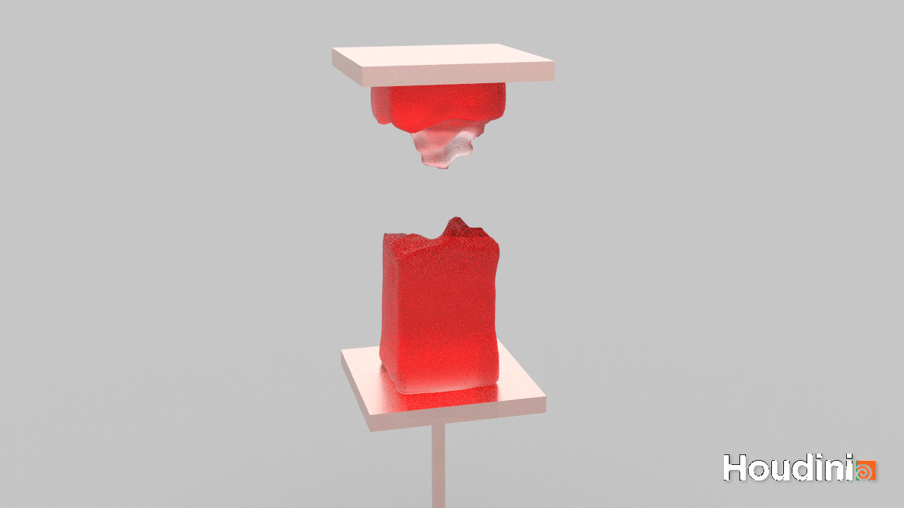

# CIS563-Fall2019-Assignment




## Install Packages (Ubuntu)
```
sudo apt install libsuitesparse-dev libxcursor-dev libxinerama-dev libopenblas-dev
sudo apt install make cmake g++ libeigen3-dev gfortran libmetis-dev libopenvdb-dev
sudo apt install libboost-all-dev libilmbase-dev libopenexr-dev libtbb2 libtbb-dev
sudo apt install libz-dev clang-format-6.0 xorg-dev libglu1-mesa-dev
```

## Build
```
cd Material-point-method-jello-simulation
mkdir build && cd build
cmake .. -DCMAKE_BUILD_TYPE=release && make -j 12
```

## Run mass spring program
```
cd ../Projects/mass_spring
./mass_spring
```
Output will be saved in Projects/mass_spring/output/, which can then be viewed by Houdini.

## Tetgen command
tetgen -pYkCVq1.1/15a1e-4BNEFI *.ply
